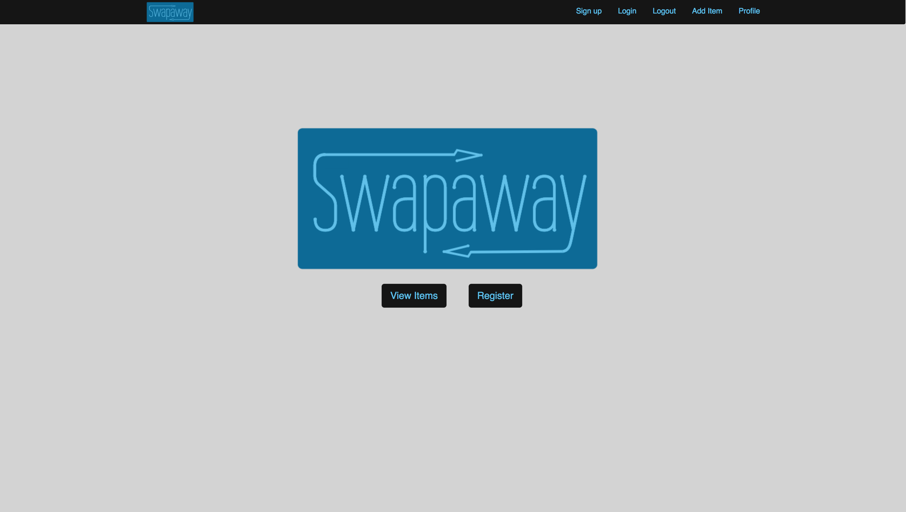
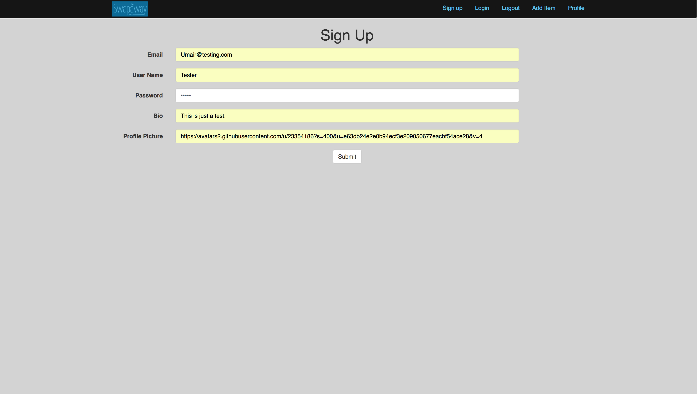
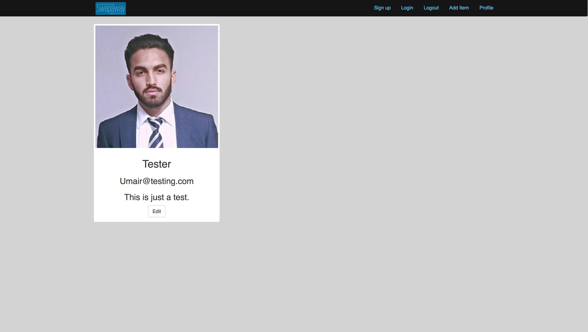
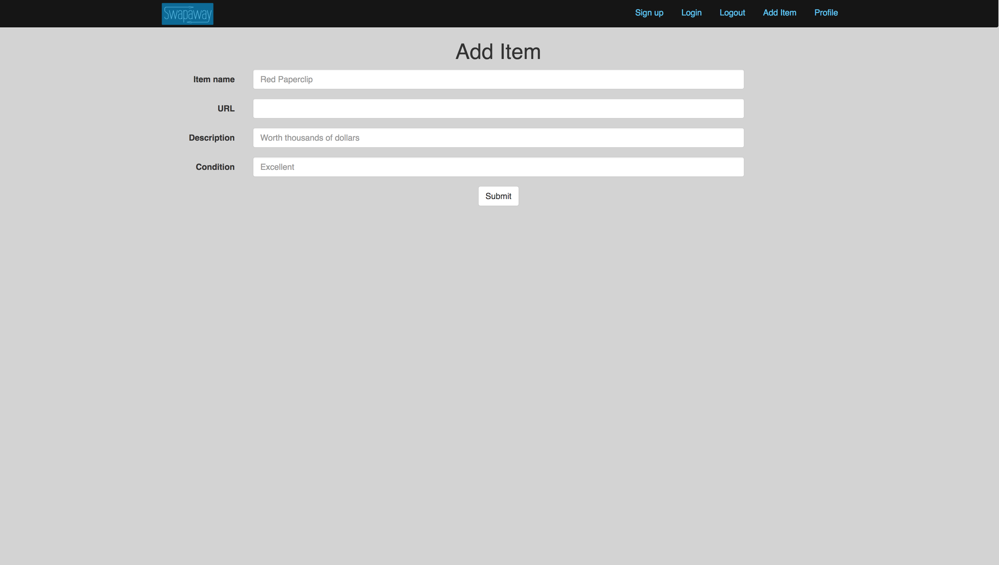
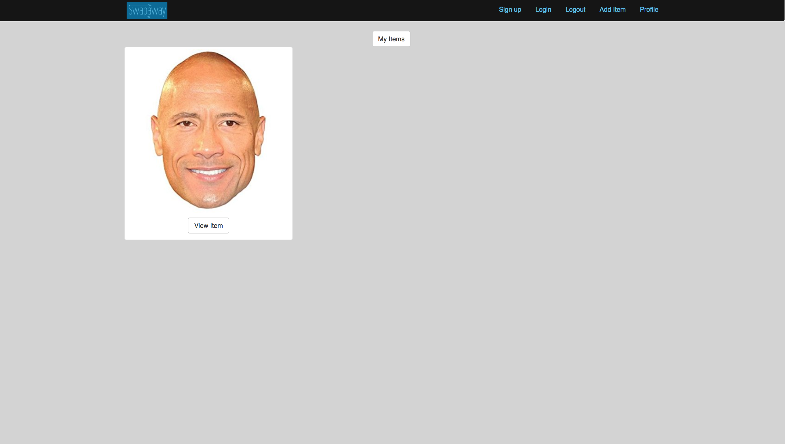
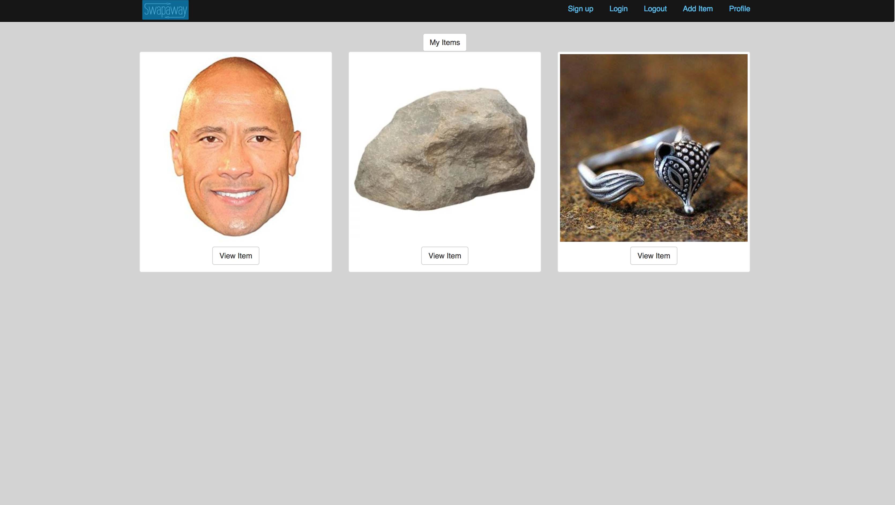
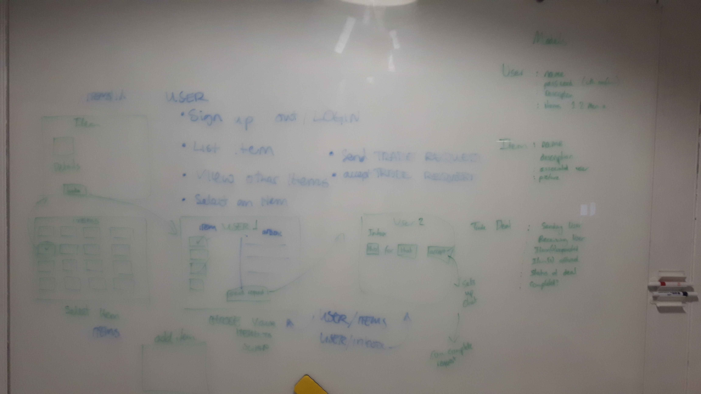
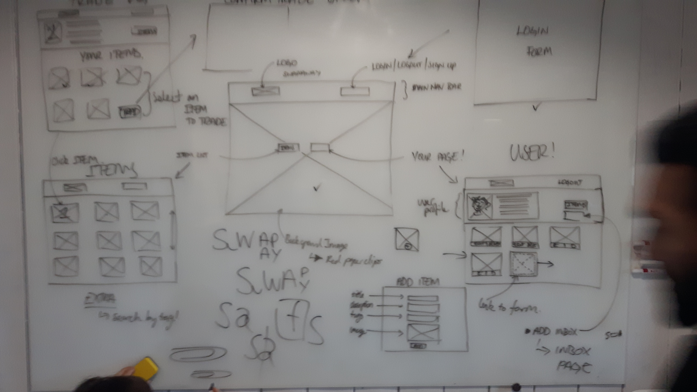

# Swapaway


This app was made over the course of two weeks as the final project for Makers Academy. The premise of the app was to make an item trading platform which streamlines the process of trading two items between users. We used a full stack that none of had used before because we wanted to challenge ourselves to learn something new.


## Tech Stack

| Tech | Description |
| ------ | ------ |
| MongoDB | A popular NoSQL database used for persistent data storage |
| Express | A library/framework that runs in the Node runtime |
| React | An open source JS library for creating front end views |
| NodeJS | JavaScript runtime used to execute code outside a browser |

## Setup

* Ensure that you have [Node.js](https://nodejs.org/en/download/) installed
* Clone the repo Swapaway from the github page using:

`git clone https://github.com/Mnargh/Swapaway`

* Navigate to the swapaway folder and install dependencies using:

`npm install`

* Install peer dependencies*

```
$ npm install
$ npm install nodemon body-parser mongoose mongoose-type-url --save
$ npm install chai mocha chai-http request --save-dev
```

* Ensure [MongoDB](https://docs.mongodb.com/manual/installation/) is installed

* Navigate to the swapaway/client folder and install dependencies using:

`npm install`

## Usage

To use the application, use the following command while inside the Swapaway folder.

`npm run dev` 

The application should auto-load in your default browser. You can see it by visiting localhost://4000

### Home Page



### Sign up



### User Profile



### Adding items



### My items



### All items




## Design Process

### User stories

```
As a user
To make my item available for a swap
I'd like to add an item
```

```
As a user
To browse items from other users
I'd like to see a list of items
```

```
As a user
To find out more about an item
I want to be able to view that individual item
```

```
As a user
To keep track of my listed items
I'd like to see them in my inventory
```

```
As a user
To make my item available for swap
I'd like to add my item to the item list
```

```
As a new user
To join this amazing website
I want to securely sign up for an account
```
### Planning






## Retrospective

### What went well
 *   Our concept was simple and concise, which helped with focusing on understanding and learning new technologies.
 *   We successfully completed our MVP, which was to set up the full stack completely and be able to store and access data in the database from within the frontend.
 * We created a functioning and useful product which could be easily expanded upon for more features.
 

### What could be improved
* More testing both on the front end and back end.
* Currently, we store the current user as a model in the database which is created and deleted when logging in/out as a work around for using sessions. Another alternative to investigate would be cookies.
* Design and styling improvements 

### What we would do with more time
* Finish off feature of trading items between users
* Add a "my trades" page where users can approve trades
* Add instant messaging functionality between users who agree a trade
* Adapt the navbar to show only relevant login/logout buttons
* Multi-item trading
* Design and styling improvements

## Team members

* [Charles Emery](https://github.com/charlesemery15)
* [Tom Brandon](https://github.com/mnargh)
* [Umair Bashir](https://github.com/umairb1)
* [Varun Madhukara](https://github.com/VarunCodes)
